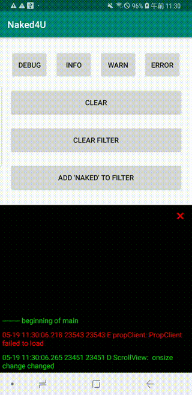

# naked4u

## Overview
NAKED4U extended the RecyclerView is visualize the application log.<br>
This library is to confirm an application log that during for QAs, Debuggers, Testers debugging apps.

## Demo
<table style="border-style: none;">
<tr style="border-style: none;">
<td style="border-style: none;"></td>
<td style="border-style: none;"></td>
</tr>
</table>

## download

Open `build.gradle` file for your app, and add below settings.

```gradle
repositories {
  url 'https://github.com/Popbrain/naked4u/raw/master/maven'
}
```

dependencies
```gradle
implementation 'com.github.popbrain:naked4u:1.3.2'

// naked4u using recyclerview
implementation "androidx.recyclerview:recyclerview:+"
```

## Implementation

Define `io.popbrain.naked4u.ViewableLogger` to your xml of layout.

res/layout/activity_main.xml
```xml
<io.popbrain.naked4u.BasicViewableLogger
        android:id="@+id/viewable_logger"
        android:layout_width="match_parent"
        android:layout_height="match_parent"
        android:background="#000000"
        android:scrollbars="vertical" />
```

MainActivity.kt
```kotlin
override fun onCreate(savedInstanceState: Bundle?) {
        super.onCreate(savedInstanceState)
        setContentView(R.layout.activity_main)

        findViewById<ViewableLogger>(R.id.viewable_logger)
            .start()
}
```

## License

```
Copyright (C) 2020 Popbrain aka Garhira.

Licensed under the Apache License, Version 2.0 (the "License");
you may not use this file except in compliance with the License.
You may obtain a copy of the License at

   http://www.apache.org/licenses/LICENSE-2.0

Unless required by applicable law or agreed to in writing, software
distributed under the License is distributed on an "AS IS" BASIS,
WITHOUT WARRANTIES OR CONDITIONS OF ANY KIND, either express or implied.
See the License for the specific language governing permissions and
limitations under the License.
```
